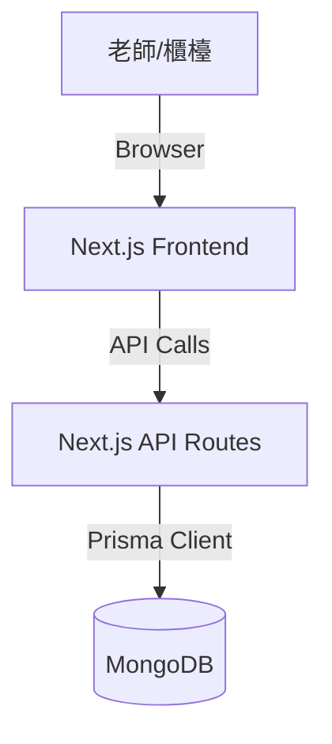

# 🎵 大發音樂管理系統 (Dafa Music ERP) - 技術規格書

## 1. 系統概觀 (System Overview)
本系統為單機版網頁應用程式，專為個人音樂教室老師設計。旨在簡化學生管理、課程安排及行事曆追蹤。

*   **目標使用者**: 老師 / 櫃檯人員 (單一使用者，無須登入)
*   **部署環境**: 單機部署 (Localhost)，透過瀏覽器存取。
*   **主要技術**: Web Service, MongoDB。

## 2. 系統架構 (System Architecture)
採用 **Next.js** 全端架構，結合前端介面與後端 API，並連接 **MongoDB** 資料庫。

*   **Frontend**: React (Next.js App Router), Tailwind CSS, Shadcn/UI (UI Component), FullCalendar (行事曆套件)。
*   **Backend**: Next.js API Routes (Node.js)。
*   **Database**: MongoDB (Community Edition installed locally)。
*   **ORM**: Mongoose or Prisma (with MongoDB provider)。建議使用 **Prisma** 以獲得更好的 Type Safety。

### 架構圖示意

## 3. 資料庫設計 (Database Schema)

基於 MongoDB Document 模型設計。

### 3.1 Artist (Student & Teacher) 
為簡化，可將老師與學生視為不同角色的「人員」，或分開 Collection。鑑於需求明確區分，採分開 Collection 設計。

#### `Student` (學生)
| 欄位名 | 類型 | 描述 |
| :--- | :--- | :--- |
| `id` | ObjectId | 唯一識別碼 |
| `name` | String | 姓名 |
| `gender` | String | 性別 (e.g. "M", "F") |
| `birthday` | DateTime | 生日 |
| `phone` | String | 電話 |
| `parentPhone` | String | 家長電話 |
| `lineId` | String | LINE ID |
| `address` | String | 地址 |
| `createdAt` | DateTime | 建立時間 |

#### `Teacher` (老師)
| 欄位名 | 類型 | 描述 |
| :--- | :--- | :--- |
| `id` | ObjectId | 唯一識別碼 |
| `name` | String | 姓名 |
| `color` | String | 行事曆代表色 (HEX) |

### 3.2 Course Definition (課程定義)
管理員預先設定的課程選項。

#### `Course` (課程)
| 欄位名 | 類型 | 描述 |
| :--- | :--- | :--- |
| `id` | ObjectId | 唯一識別碼 |
| `name` | String | 課程名稱 (e.g. 鋼琴初級A) |
| `price` | Integer | 收費金額 |
| `totalLessons` | Integer | 總堂數 (預設值) |
| `durationMinutes`| Integer | 單堂時長 (預設 60) |

### 3.3 Operations (營運資料)

#### `Enrollment` (購課紀錄)
學生購買課程的紀錄。
| 欄位名 | 類型 | 描述 |
| :--- | :--- | :--- |
| `id` | ObjectId | 唯一識別碼 |
| `studentId` | ObjectId | 關聯學生 |
| `courseId` | ObjectId | 關聯課程 |
| `purchaseDate` | DateTime | 購買日期 |
| `totalLessons` | Integer | 購買總堂數 |
| `pricePaid` | Integer | 實際支付金額 |
| `active` | Boolean | 是否仍有效 |

#### `Lesson` (課程/排課紀錄)
行事曆上的具體一堂課。
| 欄位名 | 類型 | 描述 |
| :--- | :--- | :--- |
| `id` | ObjectId | 唯一識別碼 |
| `enrollmentId` | ObjectId | 關聯購課紀錄 |
| `teacherId` | ObjectId | 關聯老師 |
| `startTime` | DateTime | 上課開始時間 |
| `endTime` | DateTime | 上課結束時間 |
| `status` | Integer | 狀態碼 (0: 未到, 1: 已簽到, 2: 請假/取消) |
| `isRescheduled`| Boolean | 是否為調課產生的紀錄 |

## 4. API 接口設計 (API Endpoints)
Base URL: `/api/v1`

### 學生管理
*   `GET /students`: 取得學生列表 (支援搜尋)。
*   `POST /students`: 新增學生。
*   `GET /students/:id`: 取得單一學生詳情 (含購課紀錄)。
*   `PUT /students/:id`: 更新學生資料。

### 老師管理
*   `GET /teachers`: 取得老師列表。
*   `POST /teachers`: 新增老師。

### 課程定義
*   `GET /courses`: 取得課程選項列表。
*   `POST /courses`: 新增課程定義。

### 排課與行事曆 (Core)
*   `POST /enrollments`: 學生購課 (System Action: 寫入 Enrollment, 並觸發 `Auto-Schedule` 邏輯生成 Lessons)。
    *   **Payload**: `studentId`, `courseId`, `teacherId`, `startDate` (YYYY-MM-DD), `startTime` (HH:mm), `totalLessons`, `pricePaid`.
    *   **Auto-Schedule Logic**: 
        1. 讀取 `Course` 的 `durationMinutes`。
        2. 從 `startDate` + `startTime` 開始，迴圈 `totalLessons` 次。
        3. 每筆 `Lesson` 的 `startTime` 間隔 7 天。
        4. `endTime` = `startTime` + `durationMinutes`。
        5. 寫入 `Lesson` Collection。
*   `GET /lessons`: 取得時間區間內的課程 (Query: `start`, `end`)，供行事曆顯示。
    *   Response 需符合 FullCalendar Event Object 格式。
*   `PATCH /lessons/:id/reschedule`: 調課 (更新 `startTime`, `endTime`)。
*   `PATCH /lessons/:id/status`: 更新狀態 (簽到/請假)。

### 簽到系統
*   `GET /lessons/today`: 取得 `startTime` 為今日的課程列表。

## 5. 前端功能模組 (Frontend Modules)

### 5.1 全域導航
*   Sidebar/TopNav 包含: 行事曆, 學生管理, 老師管理, 課程設定, 今日簽到 (快速入口)。

### 5.2 學生資料頁 (Student Profile)
*   **基本資料卡片**: 編輯 Name, Gender, Birthday, Phone, ParentPhone, LineID, Address。
*   **購課區塊**:
    *   "新增購課" 按鈕 -> 彈出 Modal。
    *   Modal 欄位: 選擇課程 (Dropdown), 選擇老師, 選擇起始日期與時間, 確認總堂數/價格。
    *   送出後前端顯示 Loading，後端處理自動排課。

### 5.3 行事曆 (Calendar)
*   使用 **FullCalendar**。
*   Header: 切換 Month/Week/Day, 上一頁/下一頁, Today。
*   Event Content: 顯示 "學生姓名 - 課程名"。
*   Event Click: 彈出詳情 Popover，包含操作:
    *   **簽到/取消簽到** (Toggle Status)
    *   **請假/調課** (Edit Date/Time)

### 5.4 今日簽到 (Check-in Dashboard)
*   卡片式佈局，列出今日所有課程。
*   每張卡片顯示: 時間, 學生姓名, 老師。
*   主要按鈕: [✅ 簽到] (變綠色), [請假] (變灰色/紅色)。
*   狀態即時反映到 DB。

## 6. 開發與部署流程
1.  **Init**: 建立 Next.js 專案, 設定 Tailwind, Install Dependencies.
2.  **DB Design**: 定義 Prisma Schema, 執行 Migration (or `db push` for MongoDB).
3.  **API Development**: 實作 CRUD API 與自動排課演算法。
4.  **UI Development**:
    *   Layout & Navigation.
    *   各功能頁面實作.
5.  **Testing**: 手動測試各 Use Case (購課自動生成, 拖拉調課, 簽到狀態更新).
6.  **Delivery**: 提供 Source Code 及啟動腳本 (`npm run start`).

---
**備註**: 由於是單機系統，所有時間皆以 Local Time 處理，不需過度考慮時區轉換問題。
